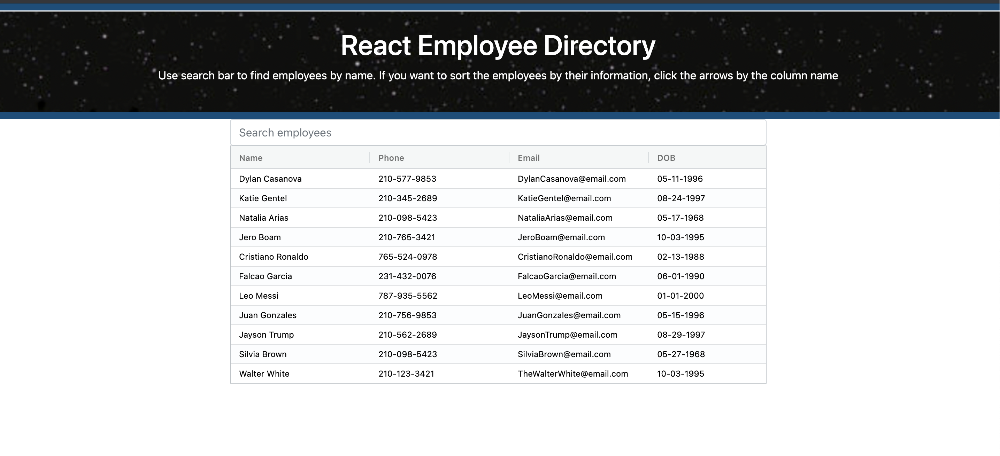
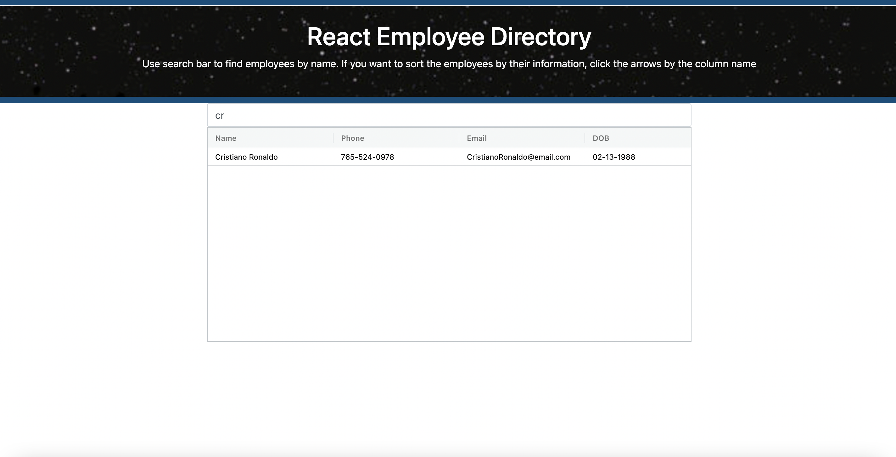

## Employee-Directory

Employee-Directory is an application that allows users to look up any employee on the directory. 
This can be done by typing the employees name on the search bar. users can also filter employees by clicking next to the any column name. 

This is what the initial screen looks like 
  

After we start typing an employee name, we can see that the table only displays employees with matching results  

## Technologies used 
I enjoyed working on this app because I got the opportunity to implement new technologies like AG-Grid.  
The table was created with Ag-Grid, which made table creating process smooth and efficient.  

# Installation
<ul>
<li>run "npm i" to install all the needed dependencies from integrated terminal.</li>
<li>Please make sure you are on the directory for the app and then from terminal run "npm start" to start the application.</li>
<li> Start enjoying this great app<li> </ul>

## Deployed app
<a href=""> click here </a>

## Contact information 

for any clarification or questions, contact me! email: dyylancasanova17@gmail.com  
if you would like to help me make this application better, please feel free to do a pull request.
GitHub: Dylan-Casanova

